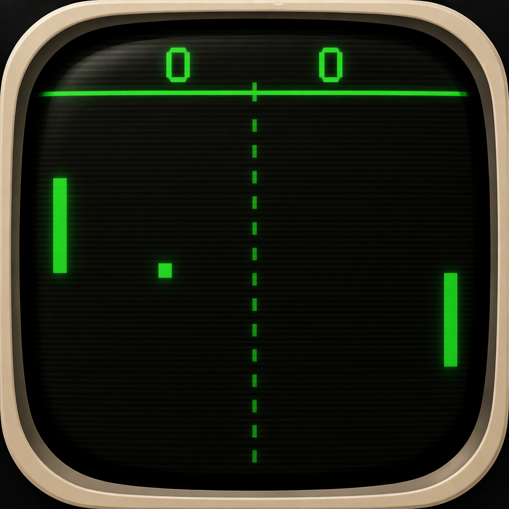

# Pong Me

A retro-styled Pong game built in Unity 6, with bold green-on-black visuals inspired by classic CRT monitors. Everything is generated programmatically at runtime — no manual scene wiring required.



## Features

- **Classic Pong gameplay** — Player vs AI, first to 3 wins
- **Procedural audio** — Synthesized retro sound effects (wall bounce, paddle hit, score, win fanfare)
- **In-game Settings panel** — Click the gear icon or press 1/2/3 to change ball speed (Slow/Medium/Fast), toggle sound on/off
- **In-game Help panel** — Click the ? icon for controls and instructions
- **Fully programmatic** — All game objects, sprites, physics, UI, and audio created in code at runtime
- **Resizable window** — Launches at 1920x1080, freely resizable

## Quick Start

### Prerequisites
- Unity 6 (6000.4.x LTS) — install via [Unity Hub](https://unity.com/download)
- macOS, Windows, or Linux

### Open & Play
1. Open Unity Hub → **Add** → select the `Pong_Me` folder
2. When prompted, import **TMP Essentials** (Window → TextMeshPro → Import TMP Essential Resources)
3. Open the scene at `Assets/Scenes/Pong.unity`
4. Press **Play**

### Build for Mac
- **From Unity:** Build → Build Mac (menu item provided by `Assets/Scripts/Editor/BuildScript.cs`)
- **From command line:**
  ```bash
  /Applications/Unity/Hub/Editor/6000.4.1f1/Unity.app/Contents/MacOS/Unity \
    -batchmode -nographics \
    -projectPath "$(pwd)" \
    -executeMethod BuildScript.BuildMac \
    -quit
  ```
- Output: `Build/Mac/PongMe.app`

### Build for Windows
Requires the **Windows Build Support (Mono)** module installed via Unity Hub (Installs → ⚙️ → Add modules).
- **From Unity:** Build → Build Windows
- **From command line:**
  ```bash
  /Applications/Unity/Hub/Editor/6000.4.1f1/Unity.app/Contents/MacOS/Unity \
    -batchmode -nographics \
    -projectPath "$(pwd)" \
    -executeMethod BuildScript.BuildWindows \
    -quit
  ```
- Output: `Build/Windows/PongMe.exe` plus `PongMe_Data/`, `UnityPlayer.dll`, and other runtime files. **All files in `Build/Windows/` must be distributed together.**
- Note: builds are unsigned, so Windows SmartScreen will warn users on first launch (More info → Run anyway).
- The user-facing `README.txt` lives at `installer/windows-README.txt` and is automatically copied into the zip by the release workflow. (Unity wipes `Build/Windows/` on every rebuild, so the README is not stored there directly.)

### Build for Web (WebGL)
Requires the **Web Build Support** module installed via Unity Hub.
- **From Unity:** Build → Build Web
- **From command line:**
  ```bash
  /Applications/Unity/Hub/Editor/6000.4.1f1/Unity.app/Contents/MacOS/Unity \
    -batchmode -nographics \
    -projectPath "$(pwd)" \
    -executeMethod BuildScript.BuildWeb \
    -quit
  ```
- Output: `Build/Web/index.html` plus `Build/Web/Build/` (the wasm/data/loader files) and `Build/Web/TemplateData/`. The `BuildWeb` method forces compression to Disabled, so files are uncompressed and the deploy workflow doesn't need Content-Encoding magic.
- **First build is slow** (5–15 minutes) because Unity has to compile to WebAssembly. Subsequent builds are faster.
- **Local testing:** WebGL builds won't open from `file://` due to browser security. Use a local web server:
  ```bash
  cd Build/Web && python3 -m http.server 8000
  ```
  Then visit http://localhost:8000 in your browser.
- **Deployment:** the release workflow syncs `Build/Web/` to `s3://pong-me.anystupididea.com/play/` on every `v*` tag. The CloudFront distribution has a function that rewrites `/play` and `/play/` to `/play/index.html` so the directory URL works.
- **Live URL:** https://pong-me.anystupididea.com/play/

### Build for iOS
Requires the **iOS Build Support** module installed via Unity Hub, plus **Xcode** installed on a Mac.
- **From Unity:** Build → Build iOS
- **From command line:**
  ```bash
  /Applications/Unity/Hub/Editor/6000.4.1f1/Unity.app/Contents/MacOS/Unity \
    -batchmode -nographics \
    -projectPath "$(pwd)" \
    -executeMethod BuildScript.BuildIOS \
    -quit
  ```
- **Output: `Build/iOS/` is an Xcode project, NOT a final `.ipa`.** Unlike the other targets, you cannot ship iOS straight from Unity. The Unity build only generates the Xcode project; everything after that is manual.

#### iOS post-build manual steps (required to actually ship)
1. Open the generated Xcode project: `open Build/iOS/Unity-iPhone.xcodeproj`
2. **Set the signing team:** select the `Unity-iPhone` target → Signing & Capabilities → choose your Apple Developer team. Without this, archiving will fail.
3. **Set the bundle identifier** if needed (e.g., `com.anystupididea.pongme`).
4. **Connect a physical iPhone or pick a simulator** in the device dropdown to verify the build compiles.
5. **Test on device** (Cmd+R) before archiving.
6. **Archive for distribution:** Product → Archive. Wait for the archive to finish (a few minutes).
7. **Validate and upload:** in the Organizer window that opens, click "Distribute App" → "App Store Connect" → "Upload". Xcode will validate, sign, and upload the build.
8. **Submit for review** in App Store Connect (or release to TestFlight first for internal testing).

There is intentionally **no GitHub Action for iOS releases** — the manual Xcode steps and Apple Developer signing flow are not amenable to a one-click pipeline without significant additional infrastructure (App Store Connect API keys, fastlane, etc.). For now, iOS is a hand-driven release.

### Build All (one-click multi-target)
- **From Unity:** Build → Build All (Mac + Windows + Web + iOS)
- **From command line:**
  ```bash
  /Applications/Unity/Hub/Editor/6000.4.1f1/Unity.app/Contents/MacOS/Unity \
    -batchmode -nographics \
    -projectPath "$(pwd)" \
    -executeMethod BuildScript.BuildAll \
    -quit
  ```
- **What "Build All" actually does:**
  - **Mac, Windows, Web** → fully built and ready to ship. Just commit `Build/Mac/`, `Build/Windows/`, `Build/Web/` and tag a `v*` release. The three GitHub Actions workflows handle signing, packaging, S3 upload, and CloudFront invalidation automatically.
  - **iOS** → only generates the Xcode project at `Build/iOS/`. **You still need to do all the manual Xcode steps above** (signing, archiving, App Store Connect upload). "Build All" does not — and cannot — ship iOS for you.
- **Time:** realistic 15–30 minutes for a cold full build (each platform switch reimports a small number of assets, and the WebGL target compiles to WebAssembly which is the slowest piece). Subsequent runs are faster. Plan to walk away from the keyboard.
- **Stops on first failure:** if any individual build fails, the rest don't run. Watch the Unity console for `[BuildAll]` log lines.

## Controls

| Key | Action |
|-----|--------|
| **W / S** | Move left paddle up/down |
| **1 / 2 / 3** | Ball speed: Slow / Medium / Fast |
| **M** | Toggle sound on/off |
| **R** | Reset / New game |
| **Cmd+Q** | Quit (Mac) |

The right paddle is AI-controlled.

## Architecture

The game bootstraps entirely from `GameSetup.Awake()`:

```
GameSetup (Bootstrap)
├── Camera (orthographic, solid black)
├── Ball → BallController (physics, speed ramp, bounce direction)
├── LeftPaddle → PaddleController (player input: W/S)
├── RightPaddle → PaddleController (AI: tracks ball Y)
├── Walls (top/bottom colliders + visible border lines)
├── GoalZones (triggers behind paddles → GameManager.ScorePoint)
├── Center Line (dashed, dim green)
├── Canvas
│   ├── Scores (top center, above border line)
│   ├── Win Text (center, hidden until game over)
│   ├── Settings Button (gear icon, top-left) → Settings Panel
│   └── Help Button (?, top-right) → Help Panel
├── SoundManager (procedural audio: wall, paddle, score, win)
├── EventSystem (routes mouse clicks to UI buttons)
└── GameManager (singleton: score state, win detection, speed control)
```

All sprites are generated from a 4x4 white texture. The gear icon is a procedurally drawn 64x64 sprite. Audio clips are synthesized square/sine waves.

## Project Structure

```
Pong_Me/
├── Assets/
│   ├── AppIcon.png              — App icon (retro CRT style)
│   ├── Scenes/Pong.unity        — Main scene
│   └── Scripts/
│       ├── GameSetup.cs         — Builds entire game at runtime
│       ├── GameManager.cs       — Score, win detection, speed/sound control
│       ├── BallController.cs    — Ball physics and collision
│       ├── PaddleController.cs  — Player input + AI
│       ├── GoalZone.cs          — Score triggers
│       ├── SoundManager.cs      — Procedural audio generation + playback
│       └── Editor/
│           └── BuildScript.cs   — Build automation (Build > Build Mac)
├── docs/
│   ├── legal/
│   │   └── TERMS_OF_USE.md      — AR safety/liability terms (DRAFT)
│   ├── research/
│   │   ├── ar_glasses_gaming_analysis.md  — AR headset comparison
│   │   ├── spotify_integration.md         — Spotify feasibility (parked)
│   │   └── Claude_Code_VSCode_Setup_Guide.md/pdf
│   └── database/
│       ├── schema.sql           — Product/Customer/Seller DDL
│       └── seed_data.sql        — Test data
├── ProjectSettings/             — Unity project configuration
├── Packages/manifest.json       — Unity package dependencies
├── CLAUDE.md                    — Claude Code guidance
└── README.md                    — This file
```

## Documentation

| Document | Description |
|----------|-------------|
| [Terms of Use](docs/legal/TERMS_OF_USE.md) | AR safety and liability terms (DRAFT — requires legal review) |
| [AR Glasses Analysis](docs/research/ar_glasses_gaming_analysis.md) | Product comparison of AR headsets for gaming (April 2026) |
| [Spotify Research](docs/research/spotify_integration.md) | Spotify integration feasibility (parked) |
| [Claude Code + VS Code Guide](docs/Claude_Code_VSCode_Setup_Guide.md) | Setup guide for new developers |
| [Database Schema](docs/database/schema.sql) | Marketplace DDL (Product, Customer, Seller) |

## License

TBD
